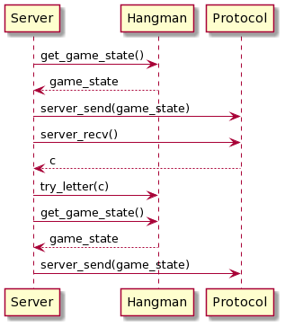

# Trabajo Práctico 1

Materia: Taller de Programación I (75.42)

Alumno: Francisco Viñas

Padrón: 103207

Link al repositorio: https://github.com/franvinas/taller1-tp1

## Introducción

El trabajo consiste en diseñar y programar el juego del ahorcado. Por un lado hay un servidor que contiene la lógica del juego y por el otro hay clientes que se pueden conectar al servidor y jugar una partida. Dicho programa está escrito en el leguaje de programación **C** y utiliza sockets para poder realizar las comunicaciones entre el servidor y el cliente.

## Descripción

### Servidor

Como se menciona en la introducción, el servidor es el encargado de manejar la lógica del juego. El servidor se ejecuta mediante el siguiente comando:

~~~
./server <port> <N> <path al repositorio de palabras>
~~~

Donde:
  * **'port'** es el puerto donde el servidor se quedará esperando conexiones de clientes
  * **'N'** es la cantidad de intentos que tiene el jugador (cliente)
  * **'path al repositorio de palabras'** es la ruta a un archivo con las palabras secretas que los clientes podrán adivinar

Cuando se ejecuta el servidor, este se queda esperando que se conecte un cliente. El servidor acepta de a un cliente a la vez.
  
Una vez terminada la ejecución del servidor, es decir cuando ya se jugaron todas las partidas posibles con las palabras dentro del repositorio de palabras, se muetra por salida estandar un resumen con las estadisticas. Este resumen muestra la cantidad de victorias y la cantidad de derrotas.
  
#### Repositorio de palabras
  
El repositorio de palabras es un archivo donde se encuentran las palabras secretas que se usarán durante el juego. En el archivo debe haber una palabra por línea y en minúscula. Además el repositorio termina con un salto de línea.
  
### Cliente

El cliente es quien juega al ahorcado y debe adivinar la palabra secreta. Este se ejecuta mediante el siguiente comando:
  
~~~
./client <host> <port>  
~~~
  
Donde:
  * **'host'** indica la dirección donde se encuentra el servidor
  * **'port'** es el puerto donde el servidor está esperando clientes

#### Interfaz de usuario

En cuanto el cliente se conecta al servidor se muestra por salida estandar lo siguiente (suponiendo que la palabra secreta es de 4 letras):

~~~
Palabra secreta: ____
Te quedan 5 intentos
Ingrese letra:
~~~

Este mensaje con el estado parcial de la partida se muestra cada vez que el usuario ingresa una letra.

Después de mostrar este mensaje el cliente se queda esperando que el usuario ingrese una letra. Esta letra será enviada a el servidor para que este la pueda procesar y enviarle un mensaje al cliente con la cantidad de intentos restantes y la palabra secreta con '_' en las letras aún no adivinadas y mostrando las letras adivinadas. Por cada letra envíada se muestra una salida como el anterior.

Además, existe la posibilidad de que el usuario escriba una sucesión de letras en lugar de una sola. Si esto ocurre, el cliente enviará una letra a la vez al servidor e imprimirá por pantalla un mensaje con el estado parcial de la partida por cada letra.

Una vez que el usuario adivina la palabra secreta o se queda sin intentos, el cliente imprime por pantalla:

~~~
Ganaste!!
~~~
o
~~~
Perdiste! La palabra secreta era: 'casa'
~~~

Notar que si el usuario pierde, se muestra por pantalla cual era la palabra secreta. En el ejemplo se supuso que la palabra secreta era 'casa'.
  
## Implementación

Para la resolución de este trabajo se hace uso de distintos TDAs. Se utilizo este enfoque para modularizar y dividir responsabilidades lo más posible. 

La comunicación entre servidor y cliente se hace mediante el TDA **protocol**. Este TDA ofrece una interfaz pensada para que tanto el servidor como el cliente puedan enviar y recibir los datos que son de su interés sin tener que preocuparse por el manejo de bits o la estrucuta de comunicación. Internamente hace uso del TDA **sockets** (common_socket.c y common_socket.h). Este TDA provee una interfaz sencilla para manejar sockets. Además, se implementó el TDA **game_state** para facilitar el acceso a la información pública de la partida.

Del lado del servidor están los TDAs: **server**, **server_summary** y **server_hangman**. 

* **server_hangman** contiene toda la logica del juego del ahorcado. A traves de su interfaz se puede crear una partida, probar letras y destruir el TDA. Internamente el TDA se ocupa de recibir letras, verificar si la palabra secreta contiene dicha letra y en consecuencia actualizar los intentos restantes y la palabra parcialmente adivinada. Dentro de este TDA se encuentra uno de los pocos usos de memoria dinámica, tanto la palabra secreta como la palabra parcialmente adivinada se alocan en el heap ya que no hay forma de saber previamente cuantos bytes se necesitarán. La diferencia entre la palabra secreta y la palabra parcialmente adivinada es que la primera se aloca por fuera del TDA y para segunda se reserva memoria dentro del constructor. 

* **server_summary** se ocupa de contar la cantidad de victorias y cantidad de derrotas. El método `summary_print` imprime por salida estandar un resumen de las partidas jugadas.

* **server** provee una interfaz con la funciones necesarias para crear y correr un servidor. La comunicación entre servidor y cliente se hace mediante sockets por lo tanto internamente **server** se hace uso del TDA **protocol** para comunicarse con los clientes. A traves de este TDA el servidor puede enviar y recibir mensajes del cliente. La función más compleja de **server** es `server_run` que se ocupa de crear una partida de ahorcado y esperar un cliente por cada palabra que hay en el repositorio de palabra. El siguiente diagrama describe el comportamiento de dicha función:

Dentro de la función `play_hangman` se encuentra la lógica de esperar que el cliente envíe una letra y luego pasar esa misma letra a **hangman** para que la procese. El siguiente diagrama muestra el comportamiento de la función:

Del lado del cliente está el TDA **client**. Este provee una interfaz que permite crear, conectar, correr y destruir un cliente. Al igual que como sucedía con **server** la función más compleja es *client_run*, esta tiene un ciclo donde le pide una letra al usuario, se la envía al servidor y luego recibe el mensaje de respuesta del servidor. 

## Consideraciones

* Una letra incorrecta resta una oportunidad siempre. Si se envía dos veces la misma letra incorrecta se restan dos oportunidades.
* Enviar una letra correcta que ya fue adivinada no resta ninguna oportunidad.
